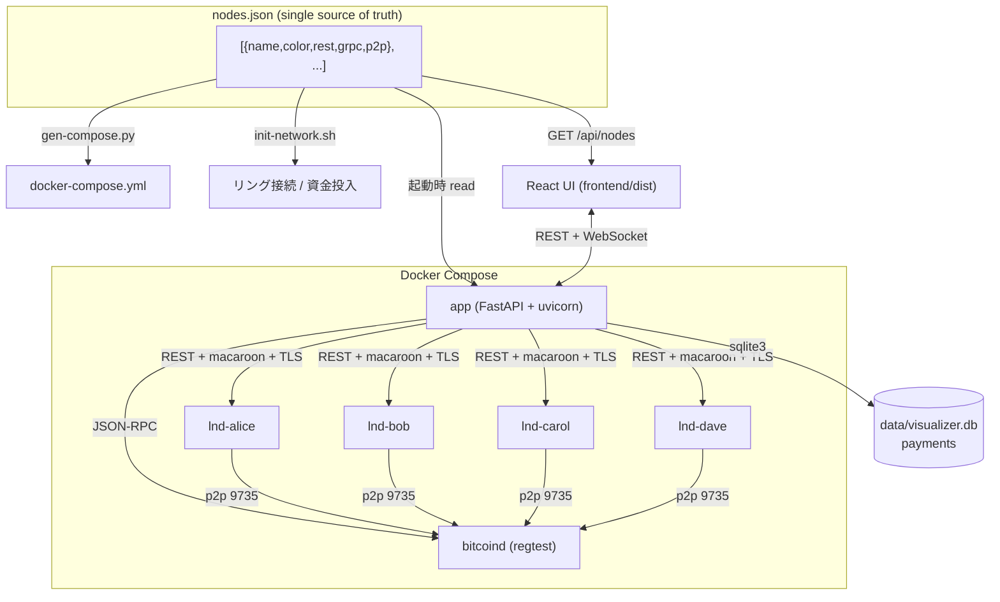
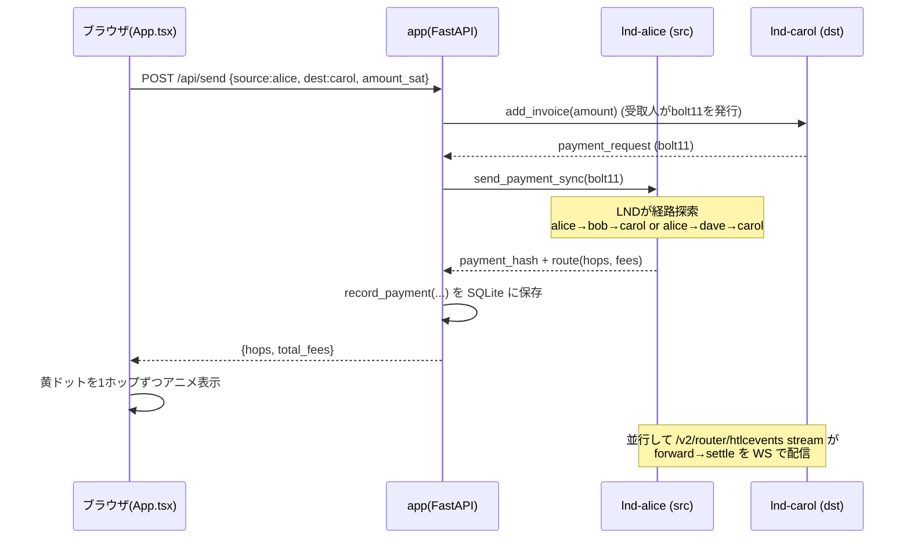
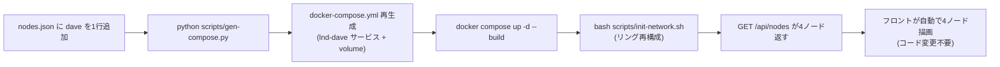

# ln-channel-visualizer — コード解説

Lightning Network (LN) の regtest ノード群を可視化し、ブラウザから送金・チャネル操作・マイニングを実行できる学習用 Web アプリ。Docker Compose だけで完結する。

---

## 1. まずアナロジーで

**チャネル = 2人の間に置いた「両替トレイ」**
AliceとBobがテーブルに1枚のトレイ（Capacity）を置き、コインを左右に分けて置く。左がAliceの取り分（local）、右がBobの取り分（remote）。「送金」とはトレイの上でコインを相手側に押すだけ。**トレイのコイン総数（Capacity）は増えも減りもしない** — 内訳が動くだけ。これが「オンチェーン取引なしの送金」の正体。

**アプリ全体 = 管制塔**
`app`（FastAPI）が管制塔。複数の飛行機（LNDノード）に無線（REST API）で「今の高度（残高）は？」と問い合わせ、レーダー画面（React UI）に映す。さらに WebSocket で3秒ごとに自動更新し、送金リクエストも無線で飛ばす。

**nodes.json = レシピの材料表（single source of truth）**
1枚の材料表を、3つの料理人（docker-compose 生成・ネットワーク初期化・UI 描画）が全員同じものを見て動く。材料を1行足せば全員が追従する。

**HTLC = 代金引換の宅配便**
送金が経路を通る間、お金は「代引きの荷物」として宙吊り。受取人が判子（preimage）を押せば各中継業者が順に精算（settle）。判子が押されなければ期限（CLTV）切れで荷物は差出人に戻る（fail）。途中でお金が消えない安全装置。

---

## 2. 全体構造

ファイルの役割:

- **`nodes.json`** — ノード定義の唯一の真実。`name`/`color`/`rest`/`grpc`/`p2p`。
- **`scripts/gen-compose.py`** — nodes.json から `docker-compose.yml` を自動生成（直接編集しない）。
- **`scripts/init-network.sh`** — nodes.json の name を読み、ウォレット作成・資金投入・**リング**接続・チャネル開設。
- **`main.py`** — FastAPI。ノード読込、REST/WS エンドポイント、HTLC ストリーム中継、bitcoind RPC。
- **`backend/lnd_client.py`** — LND REST API の薄いラッパ（macaroon ヘッダ + 自己署名 TLS 検証）。
- **`backend/db.py`** — stdlib `sqlite3` で送金履歴を永続化。
- **`frontend/src/App.tsx`** — React の単一コンポーネント。SVG でリングを描画、送金/チャネル/マイニング UI。
- **`Dockerfile`** — multi-stage（node でフロントビルド → python で配信）。

---

## 3. 送金のウォークスルー（内部送金 alice→carol）

ステップ:

1. **受取人がインボイスを作る** — 送金は「受取人が請求書(bolt11)を出し、送信者が払う」プル型。`dst.add_invoice()`。
2. **送信者が払う** — `src.send_payment_sync(bolt11)`。LND が裏で経路を探し、HTLC を張って送る。
3. **結果を記録** — `record_payment()` で `data/visualizer.db` の `payments` テーブルに追記。
4. **UI に経路を返す** — フロントが hops を受け取り、黄ドットを `pubkeyToName()` で名前解決しながら1ホップずつアニメ。
5. **HTLC ストリーム（別系統）** — 各ノードの `/v2/router/htlcevents` を `_htlc_listener` が読み続け、`forward`/`settle`/`fail` を WebSocket で全クライアントに broadcast。

並行する2つの非同期タスク（lifespan で起動）:

- `_balance_broadcaster` — 3秒ごとに全ノードの snapshot を取り WS 配信（接続クライアントがいる時だけ）。
- `_htlc_listener`（ノード数ぶん）— HTLC イベントを stream で受け、切断時は指数バックオフで再接続。

---

## 4. nodes.json が「真実」になる仕組み

backend は起動時に `_node_defs()` で nodes.json を読み、`NODE_NAMES`/`NODE_COLORS` を作る。フロントは `/api/nodes` を fetch して `NODE_ORDER`/`COLORS` を動的生成。**ノードを増やしてもフロントのコードは触らない。**

---

## 5. 注意点・ハマりどころ

- **送金はプル型** — 「送る」のに受取人のインボイスが必要。直感に反するが LN の基本。
- **inbound 流動性がないと受け取れない** — 開設直後は相手側残高(remote)が0。`push_amt` で初期配分するか、一度自分から送って作る。
- **マルチホップの中継流動性** — `alice→carol` が `no_route` になるのは、中継ノードの local 残高不足が典型。リングなら逆回り経路も試せる。
- **チャネル開設後はマイニングが必要** — regtest はブロックが自動生成されない。UI の「⛏ ブロック生成」または `init-network.sh` の 6 blocks で confirm。
- **nodes.json を Dockerfile に COPY し忘れる** — 実際に踏んだバグ。image に同梱されず `/api/nodes` が `[]` を返す（→ `knowledge/lessons.md` 記録済み）。
- **自己署名 TLS** — `httpx` の `verify` に Polar の tls.cert を渡して検証している。証明書パスが切れると全 API がコケる。

---

## 6. 改善提案

### 品質
- 🔴 **Web アプリに認証がない** — `/api/send`・`/api/channels/close`・`/api/mine` が無防備。localhost 限定の学習用なら許容だが、ネットワーク公開時は資金移動・チャネル破棄が誰でも可能。最低限 LAN バインド限定 or トークンを。
- 🟡 **`send_payment_sync` が legacy API** (`/v1/channels/transactions`) — 単一経路・MPP 非対応。学習用途では問題ないが、`/v2/router/send` への移行で多重経路・部分送金も学べる。
- ✅ **`_node_defs()` を import 時に2回読む** — 解消済み。`_NODE_DEFS` で1回読み `NODE_NAMES`/`NODE_COLORS`/`NODE_HOSTS` を生成。
- 🟡 **`_resolve_pubkey_to_name` がキャッシュミス時に全ノード get_info** — 外部 pubkey は永久にキャッシュされず、毎回全ノードへ問い合わせる。外部宛は一度「未解決」をキャッシュして抑制を。
- 🟢 **フロントの history が削除ノードの key を残す** — セッション中にノードを減らすと stale データが残る（実運用上ほぼ起きない）。

### パフォーマンス
- 🟢 **snapshot は3秒に1回・全ノード4 API 並列** — N が小さいので問題なし。N が数十になると `asyncio.gather` の総数増で見直し対象。
- 🟢 **HTLC イベントはメモリ上限50件** — `del RECENT_HTLC_EVENTS[:-HTLC_MAX]` で抑制済み。

### 可読性
- 🟢 **App.tsx が単一巨大コンポーネント（~750行）** — SVG描画・送金・チャネル・マイニングが同居。`<ChannelGraph>`/`<SendPanel>`/`<HtlcLog>` に分割すると見通しが良い。
- 🟢 **`main.py` のエンドポイントが1ファイル集中** — APIRouter で `payments`/`channels`/`routing` に分割可能。
- 🟢 **import 内の局所 import**（`import json as _json` 等）— ファイル先頭に集約してよい。

---

## 7. ロードマップ

### Phase 1（実装済み ✅）
- ✅ **インボイス生成 UI** — 「📨 インボイス生成」パネル。任意ノードで bolt11 を発行 → コピー / 「外部送金にセット」で `external_invoice` モードへ流用。backend `POST /api/invoice`。
- ✅ **peer host 自動補完** — `/api/nodes` が `host`（= `lnd-<name>`）を返す。チャネル開設フォームの「To」変更で Peer host を自動入力（手動編集も可）。
  - 補足: Polar 内 LND は全ノード `--listen=0.0.0.0:9735`。コンテナ間は DNS 名 `lnd-<name>` で解決でき p2p 公開ポート不要。
- ✅ **チャネルポリシー表示** — 各チャネル線ラベル最下行に `{node} fee {base}msat + {ppm}ppm · cltv {delta}`。backend `_snapshot` が `chan_id` と「自分が課す」ポリシーを `/v1/graph/edge/{chan_id}` から取得（`CHAN_POLICY_CACHE` で再取得抑制）。

### 学習ミッション（実装済み ✅）
- ✅ **ガイド式ミッション4課題** — 「🎯 学習ミッション」パネル。既存操作を題材に自動でチェックが点く。
  進捗はセッション内のみ（リロードでリセット）。判定は frontend 完結（`frontend/src/missions.ts`）、backend 変更なし。
  - ① はじめての送金（alice→bob）/ ② インボイスで受け取る（bob 生成→alice が pay_invoice）
  - ③ マルチホップ（alice→carol, hops≥2）/ ④ inbound 不足を体験して解消（carol 宛 fail→success）
  - 判定材料は送金系 API 応答（`/api/send`・`/api/pay_invoice`・`/api/send_route` の status/dest/hops）。
    課題④は「carol 宛 fail 観測」フラグ（`carolFailSeen`）を経た success で達成。
  - 詳細仕様は `SPEC.md`。

### Phase 2（中工数・価値大）
- **リバランス支援（循環送金）** — リング上を1周する自己送金で流動性を均す機能。`no_route` 解消を能動的に学べる。工数 **M**。
- **HTLC イベントを SQLite 永続化 + フィルタ** — リロードで消えないログ + kind/ノード絞り込み。工数 **M**。
- **選択経路のグラフ強調** — 「経路選択」で選んだ hops を SVG 上で色付きハイライト。経路と流動性の関係が直感的に。工数 **M**。

### Phase 3（将来・設計変更）
- **任意トポロジ・エディタ** — ドラッグでノード/チャネルを作りリング以外（ハブ&スポーク等）も試せる。工数 **L**。
- **認証 + マルチホスト/testnet 対応** — 公開運用やリモートノード接続。工数 **L**。
- **Watchtower / フォースクローズのペナルティ実演** — 不正クローズ → ペナルティ徴収の流れを可視化。LN セキュリティの核を学べる。工数 **L**。

---

*このファイルは `/explain-code` で自動生成。コード変更時は再生成推奨。*
