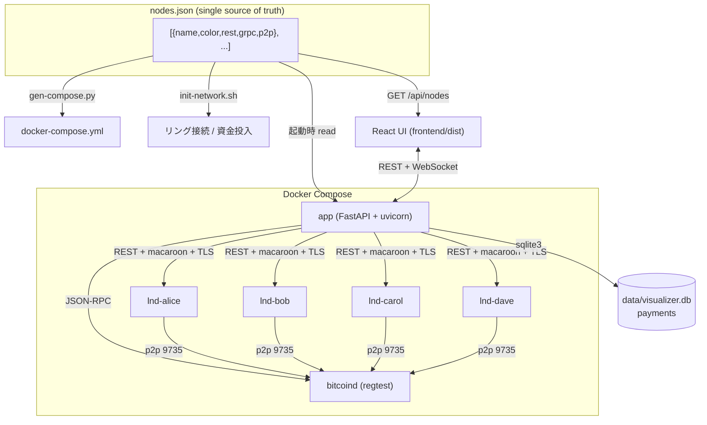
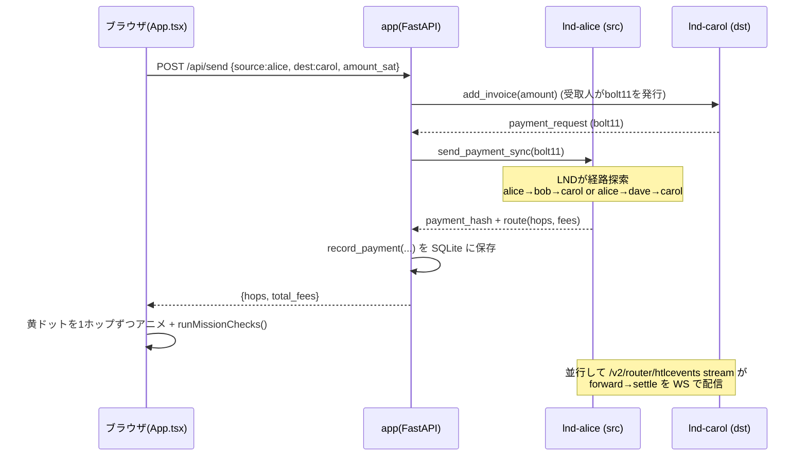
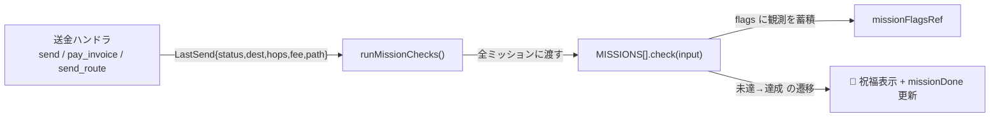
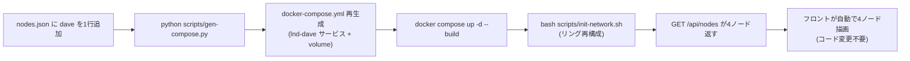

# ln-channel-visualizer — コード解説

Lightning Network (LN) の regtest ノード群を可視化し、ブラウザから送金・チャネル操作・マイニング・学習ミッションを実行できる学習用 Web アプリ。Docker Compose だけで完結する。

---

## 1. まずアナロジーで

**チャネル = 2人の間に置いた「両替トレイ」**
Alice と Bob がテーブルに1枚のトレイ（Capacity）を置き、コインを左右に分けて置く。左が Alice の取り分（local）、右が Bob の取り分（remote）。「送金」とはトレイの上でコインを相手側に押すだけ。**トレイのコイン総数（Capacity）は増えも減りもしない** — 内訳が動くだけ。これが「オンチェーン取引なしの送金」の正体。

**アプリ全体 = 管制塔**
`app`（FastAPI）が管制塔。複数の飛行機（LND ノード）に無線（REST API）で「今の高度（残高）は？」と問い合わせ、レーダー画面（React UI）に映す。さらに WebSocket で10秒ごとに自動更新し、送金リクエストも無線で飛ばす。

**nodes.json = レシピの材料表（single source of truth）**
1枚の材料表を、3つの料理人（docker-compose 生成・ネットワーク初期化・UI 描画）が全員同じものを見て動く。材料を1行足せば全員が追従する。

**HTLC = 代金引換の宅配便**
送金が経路を通る間、お金は「代引きの荷物」として宙吊り。受取人が判子（preimage）を押せば各中継業者が順に精算（settle）。判子が押されなければ期限（CLTV）切れで荷物は差出人に戻る（fail）。途中でお金が消えない安全装置。

**学習ミッション = ゲームの実績（アチーブメント）**
普段の操作（送金・インボイス・経路選択）をこなすと「実績」が自動で点灯する。新しい API は足さず、既存の送金応答を観察するだけで判定する「観測者」。

---

## 2. 全体構造

ファイルの役割:

- **`nodes.json`** — ノード定義の唯一の真実。`name`/`color`/`rest`/`grpc`/`p2p`。
- **`scripts/gen-compose.py`** — nodes.json から `docker-compose.yml` を自動生成（直接編集しない）。
- **`scripts/init-network.sh`** — nodes.json の name を読み、ウォレット作成・資金投入・**リング**接続・チャネル開設。
- **`main.py`** — FastAPI。ノード読込、REST/WS エンドポイント、HTLC ストリーム中継、bitcoind RPC。
- **`backend/lnd_client.py`** — LND REST API の薄いラッパ（macaroon ヘッダ + 自己署名 TLS 検証）。
- **`backend/db.py`** — stdlib `sqlite3` で送金履歴を永続化。
- **`frontend/src/App.tsx`** — React の単一コンポーネント。SVG でリングを描画、送金/チャネル/マイニング UI、メイン領域はタブ（⚡ネットワーク / 📖解説）。
- **`frontend/src/missions.ts`** — 学習ミッション定義（フロント同梱 SSOT）。送金応答から自動判定。
- **`Dockerfile`** — multi-stage（node でフロントビルド → python で配信）。

---

## 3. 送金のウォークスルー（内部送金 alice→carol）

ステップ:

1. **受取人がインボイスを作る** — 送金は「受取人が請求書(bolt11)を出し、送信者が払う」プル型。`dst.add_invoice()`。
2. **送信者が払う** — `src.send_payment_sync(bolt11)`。LND が裏で経路を探し、HTLC を張って送る。
3. **結果を記録** — `record_payment()` で `data/visualizer.db` の `payments` テーブルに追記。
4. **UI に経路を返す** — フロントが hops を受け取り、黄ドットを `pubkeyToName()` で名前解決しながら1ホップずつアニメ。
5. **ミッション判定** — `runMissionChecks({api, source, dest, status, hops, fee, path})` を全ミッションに渡す（後述 §4）。
6. **HTLC ストリーム（別系統）** — 各ノードの `/v2/router/htlcevents` を `_htlc_listener` が読み続け、`forward`/`settle`/`fail` を WebSocket で全クライアントに broadcast。

並行する非同期タスク（lifespan で起動）:

- `_balance_broadcaster` — 10秒ごとに全ノードの snapshot を取り WS 配信（接続クライアントがいる時だけ）。
- `_htlc_listener`（ノード数ぶん）— HTLC イベントを stream で受け、切断時は指数バックオフで再接続。

主な REST API（`main.py`）:

| Method | Path | 用途 |
|--------|------|------|
| GET | `/api/nodes` `/api/snapshot` `/api/payments` `/api/htlc_events` | 参照系（描画・履歴） |
| POST | `/api/send` `/api/pay_invoice` `/api/send_route` | 送金（内部 / bolt11 / 経路指定） |
| POST | `/api/invoice` | bolt11 発行 |
| POST | `/api/channels/open` `/api/channels/close` | チャネル開閉 |
| POST | `/api/routes` `/api/mine` | 経路探索 / ブロック生成 |
| WS | `/ws/balances` | 残高ストリーム（10秒間隔） |

---

## 4. 学習ミッションの仕組み（`missions.ts` + `App.tsx`）

ポイント:

- **判定は frontend 完結**。backend に新 API は足さない。既存の送金応答だけで判定する。
- 入力は `LastSend{api, source, dest, status, hops, fee?, path?}`。`fee`（= `total_fees`）と `path`（経由ノード名列）は ⑤⑦ のため後から追加した任意フィールド。
- 複数回の操作にまたがる課題（④⑥⑦）は `flags`（`missionFlagsRef.current`）に観測を蓄積し、条件が揃ったら達成。
- 進捗は**セッション内のみ**（`missionDone` state、リロードでリセット）。

7課題:

| # | id | 達成条件 |
|---|----|---------|
| ① | `first-send` | alice→bob の送金成功 |
| ② | `invoice-pull` | bob のインボイスを alice が `pay_invoice` で支払い成功 |
| ③ | `multi-hop` | carol 宛、hops ≥ 2 |
| ④ | `inbound-liquidity` | carol 宛 fail を観測（`carolFailSeen`）後に carol 宛 success |
| ⑤ | `pay-fee` | 送金成功かつ `fee > 0`（中継料を体感） |
| ⑥ | `both-routes` | carol 宛で `path` に bob を含む成功 と dave を含む成功 を両方（`viaBobSeen`/`viaDaveSeen`） |
| ⑦ | `bidirectional` | alice→carol（`aToC`）と carol→alice（`cToA`）を両方向 |

UI: 解説タブ（📖 解説）に HTLC・流動性管理・ミッション攻略ガイドの help-box を同梱。

---

## 5. nodes.json が「真実」になる仕組み

backend は起動時に `_node_defs()` で nodes.json を読み、`NODE_NAMES`/`NODE_COLORS` を作る。フロントは `/api/nodes` を fetch して `NODE_ORDER`/`COLORS` を動的生成。**ノードを増やしてもフロントのコードは触らない。**

---

## 6. 注意点・ハマりどころ

- **送金はプル型** — 「送る」のに受取人のインボイスが必要。直感に反するが LN の基本。
- **inbound 流動性がないと受け取れない** — 開設直後は相手側残高(remote)が0。`push_amt` で初期配分するか、一度自分から送って作る。
- **マルチホップの中継流動性** — `alice→carol` が `no_route` になるのは、中継ノードの local 残高不足が典型。リングなら逆回り経路も試せる。
- **チャネル開設後はマイニングが必要** — regtest はブロックが自動生成されない。UI の「⛏ ブロック生成」または `init-network.sh` の 6 blocks で confirm。
- **nodes.json を Dockerfile に COPY し忘れる** — 実際に踏んだバグ。image に同梱されず `/api/nodes` が `[]` を返す（→ `knowledge/lessons.md` 記録済み）。
- **自己署名 TLS** — `httpx` の `verify` に Polar の tls.cert を渡して検証している。証明書パスが切れると全 API がコケる。
- **ミッション ⑥ の経路観測は `path` 依存** — `/api/send` は LND が選んだ経路、`/api/send_route` は明示経路。bob/dave を確実に撃ち分けるには「経路選択」モード（send_route）が確実。

---

## 7. 改善提案

### 品質
- 🔴 **Web アプリに認証がない** — `/api/send`・`/api/channels/close`・`/api/mine` が無防備。localhost 限定の学習用なら許容だが、ネットワーク公開時は資金移動・チャネル破棄が誰でも可能。最低限 LAN バインド限定 or トークンを。
- 🟡 **`send_payment_sync` が legacy API** (`/v1/channels/transactions`) — 単一経路・MPP 非対応。`/v2/router/send` への移行で多重経路・部分送金も学べる。
- 🟡 **`payExternal` の `path` が `[source, dest]` 固定** — 外部宛は経路名解決が困難なため簡易化。⑥（bob/dave 観測）が外部送金では機能しない点に注意（内部送金前提なので実害は小）。
- 🟡 **`_resolve_pubkey_to_name` がキャッシュミス時に全ノード get_info** — 外部 pubkey は永久にキャッシュされず、毎回全ノードへ問い合わせる。一度「未解決」をキャッシュして抑制を。

### パフォーマンス
- 🟢 **snapshot は10秒に1回・全ノード並列** — N が小さいので問題なし。N が数十になると `asyncio.gather` の総数増で見直し対象。
- 🟢 **HTLC イベントはメモリ上限50件** — `del RECENT_HTLC_EVENTS[:-HTLC_MAX]` で抑制済み。

### 可読性
- 🟡 **App.tsx が単一巨大コンポーネント（~1000行）** — SVG描画・送金・チャネル・マイニング・タブ・ミッションが同居。`<ChannelGraph>`/`<SendPanel>`/`<HtlcLog>`/`<DocsTab>` に分割すると見通しが良い。
- 🟢 **解説 help-box が App.tsx にハードコード** — `missions.ts` のように `docs.ts` へ外出しすると、ミッションと解説の SSOT が揃う。
- 🟢 **`main.py` のエンドポイントが1ファイル集中** — APIRouter で `payments`/`channels`/`routing` に分割可能。

---

## 8. ロードマップ

### Phase 1（すぐやる・低コスト高効果）
- **選択経路のグラフ強調** — 「経路選択」で選んだ hops を SVG 上で色付きハイライト。⑥（bob/dave 撃ち分け）の達成も視覚的に。期待効果: 経路と流動性の関係が直感化。工数 **S**。
- **ミッション進捗の localStorage 永続化** — リロードで消えない。期待効果: 学習の継続性。工数 **S**。
- **解説 help-box を `docs.ts` へ外出し** — SSOT 化。期待効果: ミッションと解説の整合維持が楽に。工数 **S**。

### Phase 2（次にやる・中工数）
- **リバランス支援（循環送金）** — リング上を1周する自己送金で流動性を均す。期待効果: `no_route` 解消を能動的に学べる（⑦の発展）。工数 **M**。
- **HTLC イベントを SQLite 永続化 + フィルタ** — リロードで消えないログ + kind/ノード絞り込み。期待効果: 失敗時の巻き戻し観察が再現可能に。工数 **M**。
- **push_amt 付きチャネル開設 UI** — 開設フォームに push_amt を追加。期待効果: ④/⑧（inbound 確保）の体験が明示的に。工数 **M**。

### Phase 3（将来・設計変更）
- **任意トポロジ・エディタ** — ドラッグでノード/チャネルを作りリング以外（ハブ&スポーク等）も試せる。期待効果: トポロジ依存の経路学習。工数 **L**。
- **認証 + マルチホスト/testnet 対応** — 公開運用やリモートノード接続。工数 **L**。
- **Watchtower / フォースクローズのペナルティ実演** — 不正クローズ → ペナルティ徴収の流れを可視化。LN セキュリティの核を学べる。工数 **L**。

---

*このファイルは `/explain-code` で自動生成。コード変更時は再生成推奨。*
