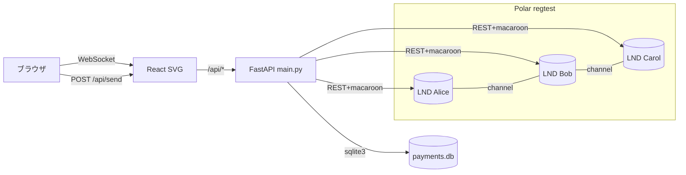
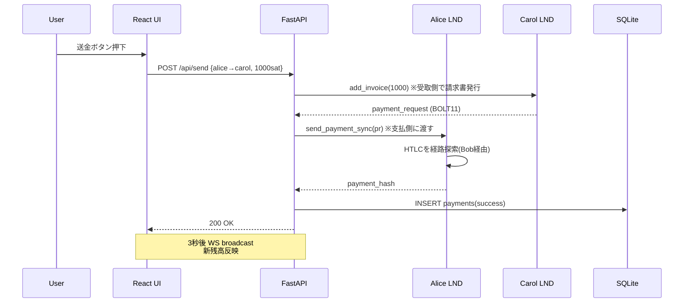

# ln-channel-visualizer 解説

## 1. アナロジー

**Lightning Channel = 2人で共有する貯金箱**

AliceとBobが机に貯金箱を置く。中に100万satを入れて鍵を二人で持つ。
- Alice側に積まれたコイン = `local_balance`
- Bob側に積まれたコイン = `remote_balance`
- 箱の総容量 = `capacity`

支払いとは「箱を開けずに、机の上で何枚かコインをBob側に滑らせる」だけ。ブロックチェーンに記録しない=オフチェーン=高速・低手数料。

**マルチホップ送金 = バケツリレー**

Alice→Carolへ直接の貯金箱がなくても、Alice→Bob→Carolと2つの貯金箱を経由してリレーする。Bobは手数料を取って中継する宿屋の主人。

**このアプリ = 机を上から見るカメラ**

Polar(regtest上のミニ宇宙)で動く3つの貯金箱の様子を俯瞰し、コインの分布をリアルタイム表示。「送金ボタン」で机上のコインを動かす。

---

## 2. アーキテクチャ図



## 3. 送金フロー



---

## 4. コードウォークスルー

### `main.py` 起動部
1. `load_dotenv()` で `.env` 読込
2. `lifespan` で `init_db()` → SQLite テーブル作成
3. `_load_nodes()` で env変数からAlice/Bob/Carolの接続情報を構築
4. 各ノードに `LndClient` インスタンス生成 → `CLIENTS` dict 格納
5. `asyncio.create_task(_balance_broadcaster())` でバックグラウンドポーラー起動

### `_balance_broadcaster()` ループ
- 3秒毎(POLL_INTERVAL) に `_snapshot()` 実行
- WebSocket接続(WS_CONNECTIONS) 全員に JSON 送信
- 切れた接続は dead リスト→ discard

### `_snapshot()` 並列取得
```python
info, channels, balance = await asyncio.gather(
    client.get_info(),
    client.list_channels(),
    client.channel_balance(),
)
```
3ノード × 3API = 9リクエストを並列実行。`asyncio.gather` でI/O待ちを重ねる。

### `/api/send` 送金エンドポイント
1. バリデーション(source/dest存在、異なる、amount>0)
2. **受取側**で `add_invoice` → BOLT11 payment_request 生成
3. **支払側**に `send_payment_sync(pr)` で投げる
4. payment_error あれば failed記録、無ければ success記録
5. 例外時は error 記録 + 500応答

### `backend/lnd_client.py`
- LND REST APIラッパ
- 認証: `Grpc-Metadata-macaroon` ヘッダに macaroon の hex
- TLS: Polar の自己署名 cert を `verify=` に渡す

### `frontend/src/App.tsx`
- WebSocket購読 → snapshot受信 → state更新 → 再レンダリング
- SVG `<line>` 3本 (Alice-Bob, Bob-Carol, etc) を `local_balance/capacity` 比率位置に黄色マーカー
- 送金フォーム → fetch POST → 履歴を `/api/payments` から再取得

---

## 5. 注意点 (よくある誤解)

- 🚨 **「送金=トランザクション署名してbroadcast」ではない**: LNはオフチェーン。状態更新コミットのみ。チャネル閉じる時だけon-chain
- 🚨 **invoice発行は受取側で**: Pull型決済。支払側が勝手に押し付けはできない
- 🚨 **`local_balance` は「自分が送れる量」**: 受け取れる量は `remote_balance` (=インバウンド流動性)
- 🚨 **regtest != mainnet**: Polar内は時間止まる=ブロック手動マイニング必要
- 🚨 **REST macaroon は admin = 全権限**: 本番では `readonly.macaroon` 等を使い分け必須

---

## 6. 改善提案

### 品質
- 🔴 **High: WebSocket keepalive 設計不在** — `await ws.receive_text()` がブロックしてる間にbroadcast失敗を検知できず接続leak可能性。`ping_interval` or 別タスクで heartbeat 必要
- 🔴 **High: `init_db` 起動時のみ、マイグレーション無し** — スキーマ変更時に既存DB壊れる。`PRAGMA user_version` で世代管理推奨
- 🟡 **Medium: `/api/send` の例外で finally の `notify` が無くなった** — partial failure (invoice発行成功→送金失敗) でDBに `failed` だけ残るが invoice は孤児化。明示的に invoice cancel する設計検討
- 🟡 **Medium: `_snapshot` で1ノード失敗が全体スナップショットを汚染しない設計だが、エラー文字列を生で返している** — 機密パス含む可能性。サニタイズ要

### パフォーマンス
- 🟢 **Low: 3秒ポーリング全ノード並列で 9 HTTP** — 規模拡大時に LND `SubscribeChannelEvents` gRPCに移行で push型化可能
- 🟢 **Low: snapshot を毎tick全送信** — 差分配信(`diff broadcast`)でWS帯域削減可

### 可読性
- 🟡 **Medium: `main.py` に全部詰め込み** — `routes/`, `services/` に分割でテスタビリティ向上
- 🟢 **Low: `NODE_NAMES` ハードコード** — `.env` で動的列挙化すると拡張容易
- 🟢 **Low: SVG描画ロジックが `App.tsx` に直書き** — `ChannelGraph.tsx` 分離推奨

---

## 7. ロードマップ

### Phase 1 (すぐやる)
| 項目 | なぜ | 工数 |
|------|------|------|
| 送金アニメーション (黄色マーカー移動) | 学習効果激増・元アイデアの核 | S |
| `/api/channels/open` `/close` ボタン | Polar GUIに行かず完結 | M |
| 残高変化グラフ (Chart.js, 直近1h) | チャネル動態の可視化 | S |
| エラーバナーの自動消去 | UX改善 | S |

### Phase 2 (次にやる)
| 項目 | なぜ | 工数 |
|------|------|------|
| MPP (マルチパス送金) 可視化 | 経路分割を学習 | M |
| インバウンド流動性ダッシュボード (送信可能/受信可能 sat) | 流動性概念の体得 | M |
| 失敗ケース実験モード (流動性枯渇シナリオ自動構築) | failureから学ぶ | L |
| HTLC タイムロック可視化 | プロトコル深掘り | M |

### Phase 3 (将来)
| 項目 | なぜ | 工数 |
|------|------|------|
| signet/testnet 接続切替 | 外部世界デビュー | L |
| 任意Nノード対応 (`.env` 動的) | スケール対応 | L |
| gRPC subscription 化 (`SubscribeInvoices`/`SubscribeChannelEvents`) | リアルタイム性向上 | L |
| Onion Routing 可視化 (Sphinx layer 描画) | LN の核心理解 | XL |
| ROI Dashboard (アイデア3.3) 統合 | 学習ルートの自然な続き | L |

---

*生成: 2026-05-31 / explain-code skill*
