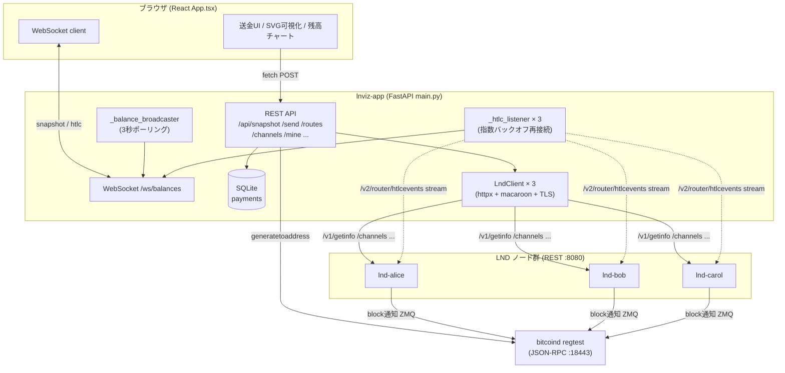
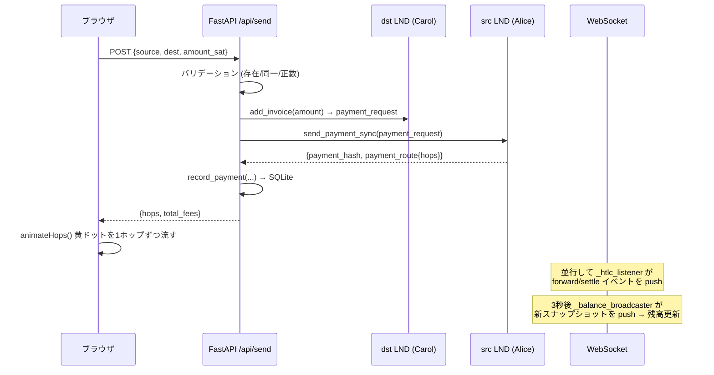

# ln-channel-visualizer コード解説

> Polar regtest の 3 ノード (Alice / Bob / Carol) を可視化する Lightning Network 学習用 Web UI。
> Backend = FastAPI + WebSocket、Frontend = React + SVG、bitcoind + LND×3 + app の全 Docker 構成。

---

## 1. まずはアナロジーから

### このアプリは「銀行間の振込シミュレーター付き模型ジオラマ」

3 人の友達（Alice / Bob / Carol）がいて、それぞれ財布を 2 つ持っている。

- **オンチェーン残高 (⛓ on-chain)** = 自宅の金庫。安全だが、送金には毎回「公証役場（ブロックチェーン）」を通す必要があり遅い・手数料が高い。
- **オフチェーン残高 (⚡ off-chain)** = 友達同士で開いた「共同のツケ払い帳（チャネル）」。一度ノートを開いておけば、その後は二人の間で「君が 1000、僕が 9000」と数字を書き換えるだけ。一瞬・ほぼ無料。

チャネル = 二人で 10000 sat を出し合って開いた割り勘ノート。
- 左側（緑 = Local）= 「いま自分が相手に渡せる額」
- 右側（赤 = Remote）= 「いま相手が自分に渡せる額」= **自分の受取可能枠（インバウンド流動性）**

そして肝心なのが **マルチホップ**。Alice と Carol が直接ノートを持っていなくても、`Alice—Bob` と `Bob—Carol` のノートがあれば、Bob を中継して Alice→Carol に送れる。これが Lightning の本質。このアプリはその「ノートの数字が書き換わる様子」をリアルタイムの図で見せてくれる。

### WebSocket の部分は「実況中継カメラ」

ページを開くと、バックエンドが 3 秒ごとに全ノードの残高を撮影して、開いている全ブラウザに同じ映像を配信する。誰かが送金すれば、次のフレームで数字が動く。HTLC イベントは「振込が今どの中継地点を通過したか」の実況テロップ。

---

## 2. 全体構造の図

### データフロー（送金 1 回の流れ）

---

## 3. コードのウォークスルー

### 起動シーケンス (`main.py` lifespan, L84-108)

1. `init_db()` で SQLite の `payments` テーブルを用意。
2. `_load_nodes()` が環境変数 `LND_{ALICE,BOB,CAROL}_REST / _TLS_CERT_PATH / _MACAROON_PATH` を読む。**ファイルが無いノードは skip** して、あるノードだけで起動する（部分起動を許容）。
3. 各ノードの pubkey をキャッシュ (`PUBKEY_TO_NAME`) に warm-up。pubkey ⇄ 名前の相互変換に使う。
4. バックグラウンドタスクを起動:
   - `_balance_broadcaster()` × 1 — 3 秒ごとにスナップショットを WS 配信（**接続が 0 なら撮影自体スキップ**＝無駄打ちしない）。
   - `_htlc_listener(name)` × ノード数 — 各 LND の HTLC ストリームを購読し続ける。切断時は指数バックオフ（1→2→…→最大30秒）で再接続。

### LND との通信 (`backend/lnd_client.py`)

- `LndNode.macaroon_hex()` がマカロン（認証トークン）を読んでヘックス化し、`Grpc-Metadata-macaroon` ヘッダに載せる。これが LND REST の認証方式。
- `verify=node.tls_cert_path` で Polar の自己署名証明書を検証に使う（証明書を信頼する形）。
- ストリーム系 (`subscribe_htlc_events`, `close_channel`) は `httpx.stream()` + `aiter_lines()` でチャンク JSON を 1 行ずつ処理。

### スナップショット生成 (`_snapshot`, L119-149)

ノードごとに `get_info / list_channels / channel_balance / wallet_balance` を **`asyncio.gather` で並列取得** → 整形。1 ノードが失敗しても `{"error": ...}` を入れるだけで全体は止まらない。

### 送金 (`/api/send`, L238-282)

「**受取人がインボイスを作り、送金者がそれを払う**」という Lightning の基本フロー：
1. dst で `add_invoice` → `payment_request` (bolt11) を得る
2. src で `send_payment_sync` → 経路 (`hops`) と手数料が返る
3. 成否を SQLite に記録。失敗時も `failed` / `error` で記録して握りつぶさない。

他に `/api/pay_invoice`（外部 bolt11 を直接払う）、`/api/routes` + `/api/send_route`（経路を手動選択して送る）、`/api/channels/open|close`、`/api/mine`（regtest でブロック生成）がある。

### フロント (`frontend/src/App.tsx`)

- 初回 `useEffect` で WebSocket 接続。`snapshot` メッセージで残高更新＋履歴（最大 60 点）に追記、`htlc` メッセージでイベントログに追記。
- SVG でノードを円形配置 (`nodePosition`)、チャネルを**緑/赤の二色線**で local/remote 比率を表現。分割点に黄マーカー。
- 送金成功時 `animateHops()` が黄ドットを `setTimeout` で 1 ホップ 1200ms ずつ流す。
- `humanizePaymentError()` が LND の生エラー文字列を日本語の対処法に翻訳（学習用 UI として秀逸）。

---

## 4. 注意点・よくある誤解

- **Local / Remote の向きを取り違えやすい**。Local = 自分が送れる量、Remote = 自分が受け取れる量。「残高がある＝送れる」ではなく、方向がある。
- **チャネルは開設後すぐ使えない**。6 ブロックのマイニング (`/api/mine`) で confirm されて初めて `active` 🟢 になる。`no_route` エラーの多くは「チャネルがまだ pending」or「中継ノードの local 残高不足」。
- **regtest 専用**。`--noseedbackup` でシードバックアップ無効・自己署名 TLS。**本番（mainnet）では絶対に使わない構成**。
- **マカロンは admin.macaroon**（全権限）。可視化 + 送金 + チャネル開閉まで全部できてしまうので、外部公開厳禁。

---

## 5. 改善提案

### 品質
- 🔴 **`/api/send` の二重送金リスク**: UI 側の連打防止は `sending` フラグのみ。ネットワーク遅延中に多重実行の余地。冪等キー or サーバ側の in-flight ロックを検討。
- 🟡 **`_resolve_pubkey_to_name` の全クライアント走査 (L73-80)**: キャッシュミス時に全ノードへ `get_info` を投げ直す。外部 pubkey は永遠にキャッシュに乗らず毎回全舐めする。
- 🟡 **WebSocket keepalive が受信ループのみ (L509-510)**: クライアントが無言だと切断検知が遅れる。ping/pong フレーム + タイムアウトが望ましい。
- 🟢 **`del RECENT_HTLC_EVENTS[:-HTLC_MAX]` (L193)**: `collections.deque(maxlen=50)` のほうが意図が素直。

### パフォーマンス
- 🟡 **スナップショットが毎回フル取得**: 3 秒ごとに全ノード 4 エンドポイントを叩き、差分が無くても全量 push。変化検知して差分配信すれば帯域削減。
- 🟢 **`channelLines` の `findIndex` 二重ループ (App.tsx L357-369)**: ノード 3 つなら無視できるが、pubkey→index の Map で O(N²)→O(N)。

### 可読性
- 🟡 **`main.py` が 528 行の単一ファイル**: ルーター（payments / channels / mining）を `APIRouter` で分割すると見通しが良い。
- 🟢 **マジックナンバー重複**: `POLL_INTERVAL=3`（バック）と履歴間隔 3 秒（フロント）が二重定義。共有設定にできると整合が取りやすい。
- 🟢 **`detail: any` (App.tsx L41)**: HTLC イベントの型が `any`。LND の型を起こすと event_type 分岐が型安全になる。

---

## 6. ロードマップ（次に何を作るか）

### Phase 1（すぐやる・低コスト高効果）
- **送金ボタンのサーバ側冪等化** — なぜ: 連打/再送での二重送金を防ぐ。学習用でも「同じ invoice は二重送金不可」を体感できる。工数: **S**
- **HTLC イベントを SVG 経路アニメと連動** — なぜ: 現状アニメは API レスポンスの hops 駆動。実際の forward/settle イベントで色を変えると「中継の実況」がリアルになる。工数: **S**
- **`deque(maxlen=)` 化 + pubkey→index Map** — なぜ: 上記レビュー指摘の軽微な品質改善。工数: **S**

### Phase 2（次にやる・中工数で価値大）
- **チャネル残高の time-travel スライダー** — なぜ: 履歴 60 点を遡って「あの送金で残高がどう動いたか」を再生。学習効果が跳ねる。工数: **M**
- **失敗経路の可視化** — なぜ: `no_route` / 残高不足を図上で赤くハイライトし「なぜ送れないか」を見せる。`humanizePaymentError` と連動。工数: **M**
- **APIRouter 分割 + 設定の一元化** — なぜ: main.py 肥大の解消、フロント/バックの 3 秒等の重複排除。工数: **M**

### Phase 3（将来・大きな設計変更）
- **ノード数を可変に** — なぜ: 現状 Alice/Bob/Carol 固定。N ノード対応にすると複雑なトポロジ（リング/メッシュ）でのルーティング学習ができる。compose 動的生成 + フロントのレイアウト一般化が必要。工数: **L**
- **AMP / MPP（マルチパート送金）の可視化** — なぜ: 1 送金を複数経路に分割する LN の高度機能を図で見せる。LND の `/v2/router/send` ストリームへの移行が前提。工数: **L**
- **testnet 接続モード** — なぜ: regtest の閉じた世界から実ネットワークの一部へ。マカロン権限の最小化・セキュリティ設計の作り直しが必須。工数: **L**

---

*このファイルは `/explain-code` により自動生成。コード変更時は再生成推奨。*
